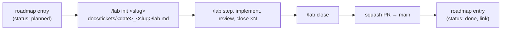

# Roadmap

The tickets that turn this repository into **App Template**: a chat clone (user → message →
assistant reply) built as a worked example of an Effect v4 modular monolith on
Bun, with Postgres, AWS and Pulumi, so that a new enterprise project starts from it in minutes.

This file is the **only place a future ticket exists** before `/lab init <slug>` starts it: each
entry below holds what a ticket is *for* (goal, scope, out of scope, dependencies, inherited
requirements, open questions); the *how* is decided in its lab. `init` seeds the lab's Intent from
the entry, and the entry's `Status` becomes a link to the ticket folder. At the lab's close, the
row is marked done and the entry's section goes, so the PR's squash carries both.

## How a ticket flows

```mermaid
graph LR
  R["roadmap entry<br/>(status: planned)"] --> F["/lab init &lt;slug&gt;<br/>docs/tickets/&lt;date&gt;_&lt;slug&gt;/lab.md"]
  F --> S["/lab step, implement, review, close ×N"] --> C["/lab close"]
  C --> PR["squash PR → main"]
  PR --> R2["roadmap entry<br/>(status: done, link)"]
```

- **One ticket = one branch `<type>/<slug>` cut from `main` = one squash-merged PR.**
- **`main` is the only long-lived branch:** the steps of a merged ticket stay in its PR's commit
  list and its `lab.md`; see [sdd.md › Roadmap and history](./sdd.md#roadmap-and-history).
- **Order below is the default, dependencies are the law.** A ticket may start when every entry in
  its `Depends on` is done. Two independent tickets may run in parallel on separate branches.
- **Facts expire.** Every `Facts` line carries the date it was checked; `/lab init` has a
  `researcher` re-check the ones it relies on.

## Tickets

| # | Ticket | Type | Depends on | Status |
|---|---|---|---|---|
| 1 | `template-bootstrap` | `chore` | — | done: [docs/tickets/2026-10-17-1508_template-bootstrap/](../tickets/2026-10-17-1508_template-bootstrap/feature.md) |
| 2 | `claude-toolkit` | `chore` | 1, 3 | done: [docs/tickets/2026-10-20-2313_claude-toolkit/](../tickets/2026-10-20-2313_claude-toolkit/feature.md) |
| 3 | `chat-core` | `feat` | 1 | done: [docs/tickets/2026-10-17-1748_chat-core/](../tickets/2026-10-17-1748_chat-core/feature.md) |
| 4 | `postgres-drizzle` | `feat` | 3 | done: [docs/tickets/2026-10-22-1915_postgres-drizzle/](../tickets/2026-10-22-1915_postgres-drizzle/feature.md) |
| 5 | `aws-local` | `feat` | 3 | done: [docs/tickets/2026-10-19-1448_aws-local/](../tickets/2026-10-19-1448_aws-local/feature.md) |
| 6 | `llm-providers` | `feat` | 5 | done: [docs/tickets/2026-10-29-1435_llm-providers/](../tickets/2026-10-29-1435_llm-providers/feature.md) |
| 7 | [`web-app`](#7-web-app) | `feat` | 3 (18 for assistant attachments) | planned |
| 8 | `observability` | `feat` | 3 | done, as `telemetry-minimal`: [docs/tickets/2026-11-07-0944_telemetry-minimal/](../tickets/2026-11-07-0944_telemetry-minimal/feature.md) |
| 9 | [`aws-deployment`](#9-aws-deployment) | `feat` | 4, 5 | planned |
| 10 | `client-publishing` | `chore` | 3 | done: [docs/tickets/2026-11-04-1131_client-publishing/](../tickets/2026-11-04-1131_client-publishing/feature.md) |
| 12 | [`template-handoff`](#12-template-handoff) | `chore` | all above | planned |
| 13 | `ticket-folder-order` | `chore` | 3 | done: [docs/tickets/2026-10-20-2313_claude-toolkit/](../tickets/2026-10-20-2313_claude-toolkit/feature.md) |
| 14 | `toolkit-reading` | `chore` | 2 | done: [docs/tickets/2026-10-21-1347_toolkit-reading/](../tickets/2026-10-21-1347_toolkit-reading/feature.md) |
| 15 | `architecture-audit` | `refactor` | 4 | done: [docs/tickets/2026-10-27-1433_architecture-audit/](../tickets/2026-10-27-1433_architecture-audit/feature.md) |
| 16 | [`shared-files`](#16-shared-files) | `feat` | 15, 23 | paused: attachments removed, to be rethought ([docs/tickets/2026-11-16-1401_shared-files/](../tickets/2026-11-16-1401_shared-files/lab.md)) |
| 17 | `docs-diet` | `docs` | 15 | done, as `lean-instructions`: [docs/tickets/2026-11-02-1820_lean-instructions/](../tickets/2026-11-02-1820_lean-instructions/feature.md) |
| 18 | [`assistant-files`](#18-assistant-files) | `feat` | 6, 23 | paused: attachments removed, to be rethought |
| 20 | [`context-window`](#20-context-window) | `feat` | 6 | planned |
| 21 | [`bedrock-provider`](#21-bedrock-provider) | `feat` | 6, 9 | planned |
| 23 | `modular-monolith` | `refactor` | 15 | done: [docs/tickets/2026-10-31-0926_modular-monolith/](../tickets/2026-10-31-0926_modular-monolith/feature.md) |
| 24 | `attachment-storage-failures` | `fix` | 23 | done: [docs/tickets/2026-11-06-0947_attachment-storage-failures/](../tickets/2026-11-06-0947_attachment-storage-failures/plan.md) |
| 25 | `toolkit-quality` | `chore` | 17 | done: [docs/tickets/2026-11-04-1009_toolkit-quality/](../tickets/2026-11-04-1009_toolkit-quality/feature.md) |
| 26 | `domain-from-data` | `refactor` | 10 | done: [docs/tickets/2026-11-06-1005_domain-from-data/](../tickets/2026-11-06-1005_domain-from-data/plan.md) |
| 29 | `sdd-stages` | `chore` | 2 | done: [docs/tickets/2026-11-07-1232_sdd-stages/](../tickets/2026-11-07-1232_sdd-stages/feature.md) |
| 30 | `effect-4-1` | `chore` | PR #39 | done, in the design audit's PR #39 |

The ticket `2026-10-16-1607_effect-setup` is **superseded at S12**; later tickets built what it
left.

### 7. `web-app`

- **Goal.** The chat UI a visitor uses: TanStack Start on React 19, `@effect/atom-react` for
  state over the typed client, Chakra UI v3 for components, streaming replies, inline
  placeholders, a chat list, all server-rendered and hydrated.
- **Scope.** `apps/web` rebuilt on TanStack Start (Vite 8, Nitro `bun` preset in dev); TanStack
  Router, Query and DB where they fit (intent recorded; see the open question); `effect/reactivity`
  atoms with `AtomHttpApi` over the web's generated client and `HydrationBoundary` for SSR; Chakra
  UI v3 theme in `packages/ui`; a nested `biome.json` (`"root": false, "extends": "//"`) with the
  `react` domain; the visitor cookie flowing through the Start server; the web `Dockerfile` or
  Nitro output for 9.
- **Out of scope.** Authentication; mobile; i18n.
- **Open questions for its feature phase.** TanStack Query and TanStack DB overlap with
  `AtomHttpApi` and atoms: which owns server state, which owns client state, or whether atoms alone
  suffice and Query/DB stay out; whether web client code may now import `effect` (today it is
  banned by Biome and must change for atoms); SSR of streams.
- **Re-read against `chat-core` (2026-10-20).** "Streaming replies" means, today, polling the
  assistant message until its status is terminal, since the api streams nothing and the worker
  writes snapshots; an SSE tail is `llm-providers`' (6) open question, so this ticket depends on
  3 alone for the reply, and on 6 only for assistant attachments and placeholders.
- **Re-read against `llm-providers` (2026-10-29).** The reply now arrives whole: no snapshots, so
  the client polls until the message is terminal and shows its text at once. The
  SSE tail is this ticket's to decide, if it still earns its place. Assistant attachments and
  placeholders moved to `assistant-files` (18).
  The visitor cookie is the user cookie of `chat-core`'s `CurrentUser` security.
- **Inherited from `architecture-audit`.** `make bundle-check` builds `apps/web/app/main.ts` with
  `bun build --metafile` and refuses any package of the bundle outside `browserPackages` in
  `apps/web/package.json`, naming its import chain; `client-publishing` (10) replaced the grep of
  service keys with it ([architecture.md › Boundary guards](architecture.md#boundary-guards)). On
  the new bundler: rebuild its command, have it write a metafile the check reads (its shape is
  Bun's today), clear the output dir before each build, and keep it in `make check`, which CI runs.
- **Facts (2026-10-17).** `@tanstack/react-start@1.169.3` (router 1.170, Vite ≥ 8, React 19 for
  the Bun preset, `aws_lambda` preset with streaming); `@chakra-ui/react@3.37.0`; Effect v4 atoms
  are `effect/reactivity/*` in core plus `@effect/atom-react@4.0.5` (React ≥ 19 only) with
  `ReactHydration.HydrationBoundary`; `@effect-atom/*` is the v3 line; no official TanStack bridge
  exists; nothing is called "Effect UI".
- **To weigh.** [Ideas to weigh › Smaller fits](#smaller-fits): `Sse`, and why not `eventlog`.

### 9. `aws-deployment`

- **Goal.** One Pulumi program deploys the api, the worker, Postgres, S3 and SQS to AWS, from the
  resource inventory `aws-local` (5) introduced, and the same program provisions MiniStack for the
  "true emulator" local mode, so a new project is live in one command.
- **Scope.** `deployment/` on Pulumi `runtime: bun`; Lambda packaging for api and worker (Lambda
  Web Adapter container is the official Bun path; the `bun-lambda` layer is the alternative), the
  web on its Nitro `aws_lambda` output or static hosting; Aurora Serverless v2 with auto-pause
  versus RDS; SQS event source mapping for the worker; secrets in SSM; the local mode where
  MiniStack runs the Lambdas in Docker from the same artefacts; CI deploying a preview stack;
  `docs/knowledge/deployment.md`.
- **Out of scope.** Multi-account or multi-region; a custom domain and CDN beyond the minimum; the
  web and the observability backend while `web-app` (7) and `observability` (8) have not landed:
  each adds its own resources to this program, and one that lands first is deployed here.
- **Decided (2026-10-19).** Split from `aws-local` (5); depends on `postgres-drizzle` (4), since
  the deployed processes need a shared database, and on 5, not on 7 or 8.
- **Decided (2026-10-21).** The applications never check or create their resources: the
  infrastructure provides them (`aws-local` D5 dropped the startup `verify`); `provision` in
  `packages/aws` serves the tests only (each test file creates its own resources in milliseconds,
  without the Pulumi CLI).
- **Open questions for its feature phase.** Cold starts of `@effect/platform-bun` on Lambda; whether
  `pulumi.dynamic.Resource`, unsupported under `runtime: bun`, is ever needed.
- **Facts (2026-10-17).** Pulumi ≥ 3.227 runs TypeScript under `runtime: bun` (no function
  serialisation, no dynamic providers); CLI 3.270, `@pulumi/aws` 7.51. Bun on Lambda: the official
  guide uses Lambda Web Adapter in a container (also gives response streaming for SSE);
  `provided.al2` is deprecated since 2026-07-31. MiniStack has no Lambda hot reload and runs
  non-Python runtimes in Docker, so the emulator mode verifies deployment artefacts; live
  development stays on `bun --watch` against MiniStack's queues and buckets.
- **Rechecked (2026-10-19).** Pulumi CLI 3.270.0, `@pulumi/aws` 7.51.1. Bun runs the program only
  under `runtime: bun`, as `deployment/local` runs; the AWS stack has no project file yet. Bun's
  Lambda guide (Lambda Web Adapter 1.0.1 in a container; 1.1.0 is current) says nothing about
  response streaming. `provided.al2023` replaces `provided.al2` (deprecated 2026-07-31). Aurora
  Serverless v2 pauses at 0 ACU and resumes in about 15 s; Postgres 18 is on RDS and on Aurora
  (Serverless v2 from 18.3). App Runner has been closed to new customers since 2026-04-30; AWS
  points to ECS Express Mode. Lambda Web Functions (2026-10-12) serve HTTP without an adapter, but
  only on `nodejs24.x`, so not under Bun. SQS event source mappings with `ReportBatchItemFailures`
  remain the recommended worker pattern.
- **Inherits from `aws-local` (2026-10-22).** Check on AWS what MiniStack cannot show: the
  `unbound` tag sent with `CreateMultipartUpload` and the lifecycle deletion it drives. Share one
  AWS client builder between `kernel/aws/aws.client.ts` and the tests' clients, and
  brand `Stage`.
- **Inherits from `postgres-drizzle` (2026-10-23).** The bucket with its lifecycle rule, the
  queues with their dead-letter queues and the RDS instance are already Pulumi resources, created
  on MiniStack by `deployment/local` (`provision.ts` is gone): `deployment/aws/{provider,database,
  storage,queue}.ts` take an `aws.Provider`, so the prod stack calls them without an endpoint,
  with Aurora or RDS settings and a managed password for the database. This ticket adds the
  migration command for a deployed stage. Locally `make up` sets `VCR_MODE=REPLAY_ONLY` to skip
  the provider's fixed waits; never on AWS.
- **Inherits from `llm-providers` (2026-10-30).** `deployment/` sets no LLM variables, so a
  deployed worker fails at start: it needs `LLM_REPLY_MODEL`, `LLM_TITLE_MODEL` and
  `ANTHROPIC_API_KEY` (in SSM). The api reads none of them.
- **Inherits from `lambda` (2026-11-08).** Dev runs the worker behind MiniStack's SQS mapping in
  proxy mode: the code stays on the host. The production build in dev, api and worker as real
  Lambda functions inside MiniStack (a Bun image with Lambda Web Adapter,
  `LAMBDA_EXECUTOR=docker`, a Function URL for the api), moved here unbuilt. Two researchers'
  runs, stopped before their reports and not rechecked: an image function responded through a
  Function URL with a cold start of 130–180 ms; a partial batch failure worked; the function
  reaches Postgres only at `host.docker.internal`, not at the `localhost` the RDS endpoint
  reports; a rebuild to a response took about 2 s. Pulumi creating these functions was not run.
- **Inherits from `telemetry-minimal` (2026-11-14).** Two things only AWS can show, researched
  there with sources (`docs/tickets/2026-11-07-0944_telemetry-minimal/lab.md`, L3 and L6 Notes):
  the OTLP receivers (X-Ray traces, CloudWatch Logs and CloudWatch metrics take OTLP/HTTP directly
  with an `Authorization: Bearer <API key>` header; the switch from the local backend is the
  per-signal `OTEL_EXPORTER_OTLP_<SIGNAL>_{ENDPOINT,HEADERS}` variables, no code; Transaction
  Search, the keys and the log group must exist first; nothing was sent to a real account), and
  getting an invocation's telemetry out before Lambda freezes (Effect's exporter batches on an
  interval and the server span closes after the response; the reliable patterns are a flush
  before the response in the worker's `POST /events`, which `OtlpExporter.Flusher` gives in three
  lines, a flush after it held by an `INVOKE`-registered process, or the Collector extension
  copied into the image, since no ADOT layer exists for `provided.al2023`; the shutdown window is
  2 s with LWA, below the exporter's 3 s default).
- **Inherits from the design audit (2026-11-18).** A job's reader is released before its writer
  stops sending a field: a body with a field its schema no longer has decodes with the field
  dropped, while a reader of the old build refuses a body without it (`Missing key`), the case
  [aws.md › Queues](aws.md#queues) logs and acknowledges unrun. The reply and title jobs lost `chatId`
  this way; the title's later took `chatId` in place of `messageId`, on a new queue (2026-11-21).
- **To weigh.** [Ideas to weigh › Queue on SQS or in Postgres](#queue-on-sqs-or-in-postgres)
  decides whether the worker is a Lambda on SQS or a long-running poller;
  [Telemetry readable by an agent and on AWS](#telemetry-readable-by-an-agent-and-on-aws) the
  CloudWatch and X-Ray path.

### 12. `template-handoff`

- **Goal.** "Use this template" to a running, renamed project in ten minutes.
- **Scope.** `make rename SCOPE=@acme NAME="Acme"`; a checklist of what to delete (`docs/tickets/`
  of the template, the example domain if unwanted) and what to keep (`docs/knowledge/`, rules,
  skills); a fresh-clone rehearsal in CI; the README's "Starting a new project" rewritten; the
  GitHub template flag verified; the toolkit items that matter only when the template changes
  hands, inherited from `claude-toolkit` (2): `/skill-doctor` as a periodic check, pinning
  `mattpocock-skills` by `sha`, agent `memory`, `SessionStart` and `PostToolUse` hooks.
- **Out of scope.** A generator or CLI.

### 16. `shared-files`

- **Goal.** A user uploads files to a pool of their own and links them to a message or a chat
  later, instead of uploading for one message.
- **Scope.** The pool and the link as domain concepts, the words first; upload, list and delete
  of pool files; linking at send and to a chat; what the reply reads when a chat has linked
  files.
- **Out of scope.** Sharing between users; assistant-produced files (`assistant-files`, 18).
- **Paused (2026-11-19).** The owner removed attachments from every ring, to be rethought
  ([decisions.md › Attachments removed](decisions.md#attachments-removed)); the lab's L1 and L2
  built on them. The redesign starts from the generic core that stayed: `FileRepository` and
  `buildFileKey` in `kernel/data/file`, the kernel's S3 clients and the `attachments` bucket. Its
  first questions: the words for a file and its link, the module that owns them, and the bucket's
  name and key prefix, which still say `attachments`.
- **Inherits from `architecture-audit` (2026-10-27).** A file lives as long as its owner needs it:
  no expiry of unlinked files, so no unbound lifetime or `unbound` S3 tag.
- **Inherits from `modular-monolith` (2026-10-31, done 2026-11-02).** A module of its own for the
  files, reached by chat only through its contract, with a send that links files as one use
  case over both modules, in one transaction; the split rewrites the records
  [Modules by capability](decisions.md#modules-by-capability) and
  [Files in the data layer](decisions.md#files-in-the-data-layer), whose *Revisit when* name
  files outside a chat.
- **Open questions for its feature phase.** Whether one file may be linked to several messages;
  whether deleting a chat deletes its linked files or only the links; the quota per user; the
  owner's draft idea (2026-11-19): a library file copied into a chat before the send, so the
  draft lives on the server.
- **Status.** Paused: attachments removed, to be rethought. Its lab:
  [docs/tickets/2026-11-16-1401_shared-files/](../tickets/2026-11-16-1401_shared-files/lab.md).

### 18. `assistant-files`

- **Goal.** Files the way the Claude apps handle them: the user attaches Word, Excel, PowerPoint,
  CSV, Markdown, images and PDF; the assistant reads them and produces Word, Excel, PowerPoint,
  PDF, CSV and PNG files, shown in its text through placeholders.
- **Scope.** Anthropic's code execution tool with its `docx`, `xlsx`, `pptx`, `pdf` Skills and the
  Files API; uploading a user's file into the container; downloading produced files into S3 as
  attachments of the assistant message; the placeholder syntax; the `pause_turn` continuation;
  deleting files at Anthropic once copied; the e2e's scripted assistant producing a file; audio by a
  speech-to-text service.
- **Out of scope.** Providers other than Anthropic.
- **Open questions for its feature phase.** One container per chat or per reply; which files go
  to the model natively (images, PDF, text) and which through the container; how to send a
  `container_upload` block that `@effect/ai-anthropic`'s prompt converter cannot express (a
  local patch with an upstream PR, an own HTTP call, or converting on our side); the
  speech-to-text service
  (AWS Transcribe or another provider); retention, since code execution and the Files API are not
  zero-data-retention eligible.
- **Facts (2026-10-29).** Code execution, the Files API and Skills are GA, no beta header; Skills
  go in the request's `container.skills`; produced files are those written to `$OUTPUT_DIR` and
  come back as file ids in `bash_code_execution_tool_result`, downloaded with
  `GET /v1/files/{id}/content`; containers live 30 days; code execution costs $0.05 per container
  hour past 1 550 free hours a month per organisation, five minutes minimum, billed whenever a
  request holds files. `.docx` and `.xlsx` are not accepted by any message block, and no Claude
  model takes audio. `@effect/ai-anthropic` passes `container` through its `Config` and
  surfaces tool results with file ids; its generated Files API calls are awkward for binary
  uploads.
- **Rechecked on `@effect/ai-anthropic` 4.1.5 (2026-11-21).** Its generated schema has the
  request's `container_upload` block (`RequestContainerUploadBlock` in `Generated.ts`, as 4.0.6
  had), but the prompt converter in `AnthropicLanguageModel.ts` never emits it and still rejects
  any file media type but images, PDF and text.
- **Inherits from `modular-monolith` (2026-11-02).** The prompts and the Anthropic calls live in
  chat's assistants `MessageAssistant` and `ChatAssistant` (`application/chat/infrastructure/`),
  the provider's settings in `kernel/llm`; a produced file is stored through `FileRepository` in
  the data layer, its bytes kept before the row that binds them, since S3 joins no transaction.
  Files outside a chat reopen [Files in the data layer](decisions.md#files-in-the-data-layer).
- **Facts on AWS (2026-10-29).** Claude on Bedrock has no code execution, Files API, Skills, web
  search or Message Batches. Bedrock Converse `DocumentBlock` takes `docx`, `xlsx`, `csv`, `md`,
  `html` (how they are converted is undocumented). Bedrock Knowledge Bases answer with retrieved
  chunks, need an ingestion job and create no file: a fit for `shared-files` (16), not for a
  message's attachment. Amazon Quick's Microsoft 365 extensions are Office add-ins with no
  backend API. Bedrock Data Automation reads DOCX (as PDF), PDF, images and audio up to
  240 minutes, not `xlsx` or `pptx`, and creates no file. AgentCore Code Interpreter is the AWS
  way to create files (inline upload up to 100 MB, sessions up to 8 hours, $0.0895 per vCPU hour),
  driven by a tool loop we write. Claude Platform on AWS is Anthropic-run, billed through AWS,
  and has code execution, the Files API and Skills; its client is beta. MiniStack emulates
  Transcribe (canned transcript) and Knowledge Bases (lexical search), not Data Automation or the
  Code Interpreter.
- **To weigh.** [Ideas to weigh › Smaller fits](#smaller-fits): `Zip`, `Xml` and `workers` to
  turn Office files into text on our side.
- **Status.** Planned.

### 20. `context-window`

- **Goal.** A long chat keeps answering: the history sent to the model is trimmed to the model's
  context window instead of failing every reply once it outgrows it.
- **Scope.** Dropping the oldest messages whole, never splitting one, always keeping the system
  prompt and the newest user message; failing when even that does not fit (a failed Run
  carries no reason on the wire, so telling the user why is a contract change); counting tokens of attachments.
- **Facts (2026-10-29).** `effect/ai` `Tokenizer.truncate` drops the oldest messages whole but
  does not protect the system message; no provider package implements `Tokenizer`, so counting
  is ours (a heuristic or Anthropic's token-counting endpoint). An overlong prompt is a 400
  `InvalidRequestError` with no special mapping.
- **Status.** Planned.

### 21. `bedrock-provider`

- **Goal.** Claude on Amazon Bedrock as a third value of the provider setting, so a deployed
  project pays through its AWS bill and the worker authenticates with its IAM role instead of an
  API key.
- **Scope.** `@effect/ai-anthropic` against Bedrock's Anthropic Messages endpoint
  (`bedrock-mantle.<region>.api.aws/anthropic`) with a SigV4-signing `HttpClient` over the default
  credential chain; explicit cache points instead of the automatic top-level cache; a request
  timeout of at least two minutes for the first compile of a new schema; the IAM permission
  `bedrock-mantle:CreateInference` and model access in `aws-deployment` (9); the error mapping
  of Bedrock's gateway errors and its rate limits.
- **Out of scope.** Converse and `InvokeModel`; Bedrock-only services (Knowledge Bases, Data
  Automation, AgentCore), which belong to `assistant-files` (18) or `shared-files` (16).
- **Open questions for its feature phase.** Whether the endpoint accepts the provider's
  `?beta=true` query; how throttling surfaces and whether a wait is given; effort and thinking
  support; the global route or a regional profile (+10%).
- **Facts (2026-10-29).** `@effect/ai-amazon-bedrock` is Effect v3 only (0.17.0);
  `@effect-aws/client-bedrock-runtime@2.0.0` fits Effect 4 but is a client, not a
  `LanguageModel`. The endpoint takes the first-party request body; model ids
  `anthropic.claude-sonnet-5-5`, `anthropic.claude-haiku-5-5`. Structured output works through
  `output_config.format` (at most 12 optional and 16 union-typed properties, no length or range
  bounds, about 90 s to compile a new schema). The same model specs as Anthropic's (1M context,
  128K output); not supported: code execution, web tools, Files API, Skills, Message Batches,
  automatic prompt caching. Default quota 2M input tokens a minute, up to 5M on request.
  Billed through AWS Marketplace; the global route has no premium, regional profiles +10%;
  per-token prices were not readable from aws.amazon.com/bedrock/pricing and need the AWS
  calculator. MiniStack 1.5.31 emulates Bedrock Runtime with canned replies that fail a schema
  and does not emulate the Messages endpoint, so local runs call Anthropic.
- **Status.** Planned.

## Later

What a ticket's `Later` leaves unresolved at its PR: edge cases, error paths, hardening, open
questions. One section per ticket; each item says what goes wrong, with its file and symbol, why
it was left, and the ways out to weigh. A design audit has a section too, whose findings no
verifier has checked stand by title alone, marked so, until one does. A ticket that takes an item
moves it into its own `Later` and deletes it here.

### From `lambda-processes`

- (2026-11-09) A reply that never settles leaves its chat `queued` for good, so every next send
  fails `ChatBusyError`: a job whose body no longer decodes is failed unrun, so the reply's use
  case never runs; every delivery of a job dies, 3 receives, and nothing reads the dead-letter
  queue; or the queue drops its messages (a purge, a replaced queue, SQS's retention, 4 days by
  default and unset in the inventory). Ways out to weigh: the handler gets the undecodable body
  to fail its own work, a consumer of the dead-letter queues, or a sweep of active replies
  ([database.md › Stuck Runs](database.md#stuck-runs)).

### From `reply-run`

- (2026-11-11) A Run stays `queued` for good, its chat busy, when the api dies between the commit
  and the reply's send (`sendReplyToMessage`, called by
  `application/chat/services/ask-chat.service.ts`, the last step of `ask` and
  `retry`), or the client aborts after the commit but before the send starts: a send SQS
  refuses fails the Run, and the send and that failure run uninterruptibly, but no handler runs in a
  dead process, and an interrupt during the commit or the title's send ends the flow first. Ways out
  to weigh: one uninterruptible step from the Run's write through its send (the abort only), a
  ledger of jobs, a sweep of active Runs. The owner refused a rule by a Run's age, and keeps the
  abort's window as a cost (2026-11-20).
- (2026-11-13) Two sends or two retries of one chat that arrive within the few milliseconds between
  the check and the insert (two tabs, a client that resends) both pass their check
  (`ensureChatNotBusy`, `ensureRunRetryable`); the active Run's index refuses the second insert,
  which dies, so the client gets a bare `500`, not a `409`; a double click, its second request
  arriving after the first Run is stored, already gets the `409` (`RunRepository.insert`,
  `RunService.create`). Left: a lost race dies by
  [database.md › Guards](database.md#guards), and no client offers a retry button yet. Ways out to
  weigh: the insert fails a typed `RunActiveError` that `RunService.create` maps to
  `ChatBusyError` (an exception to `repositories.md`'s "a write dies where it misses"), or a
  `SELECT … FOR UPDATE` on the chat before the check.
- (2026-11-13) A retry reads the chat's newest Run, then inserts a new Run of that Run's message;
  a send of a newer message whose Run commits and fails between the two lets the insert pass the
  active Run's index, so an older message holds the chat's newest Run, against the premise that
  only the newest user message gets one (`application/use-cases/chat/retry-run.use-case.ts`, the
  chat's read, and `AskChatService.retry`'s `runs.create`).
  Claimed by a review, not reproduced: it needs a send, a retry and a failure in one gap of
  milliseconds. Ways out to weigh: the insert also refuses a Run of a message older than the
  chat's newest, or a row lock on the chat before the check.
- (2026-11-13) `listMessages` reads the chat, then its messages in a second query, so a delete
  between the two leaves it responding with `200 []`, not `404 ChatNotFoundError`; the next read
  gives the `404`
  (`application/use-cases/chat/list-messages.use-case.ts`). Way out: one query that reads the
  chat with its messages, or the two reads in one `REPEATABLE READ` transaction: `Transaction`
  opens with a plain `BEGIN`, so Postgres's default `READ COMMITTED` gives each statement its own
  snapshot.
- (2026-11-13) No e2e runs a worker's lost race of a completion
  (`application/chat/services/reply-chat.service.ts`, `ReplyChatService.reply`): its
  unit case mocks the Run's refused write, and `TransactionTest` takes nothing back. Way out: an
  e2e of the completion's race.
- (2026-11-13) Errors without context: `RunNotRetryableError` not why,
  `ChatBusyError` not the Run in work, the assistant's errors only `error.message`
  (`toLlmError` in `kernel/llm/llm.ask.ts`); `UserUnknownError`
  stays empty, so no secret reaches a reply or a log. Left: the lab's step for it was skipped.
  First check, by a run, which of an error's fields reach the api's and the worker's logs and
  spans.

### From `telemetry-minimal`

- (2026-11-15) Tempo's metrics per route and status lump every `POST` route into one line: its
  span metrics count by span name and status, and the api's server span is named by the method
  alone (`POST`), so `http.route` and `http.response.status_code` need dimensions in
  `otel-lgtm`'s metrics-generator config. Left: the minimal feature reads traces, not metrics.
  Ways out to weigh: those dimensions in the generator's config, or a server span named
  `<method> <route>`.
- (2026-11-15) The api's first `QueueSender.send` spends 281 ms of its 288 in
  `QueueClient.getUrl`, the second 3 ms (a trace on the local stand). Left: not looked into; it
  looks like a cold request to MiniStack. Ways out to weigh: measure it on AWS before acting, or
  resolve the queue's URL once when the layer is built.
- Entry 8's scope that the ticket narrowed away: `web` in the trace, Effect DevTools, health and
  readiness endpoints, and log conventions.

### From the design audit of 2026-11-19

- (2026-11-19, verified) The reply job's exit handler (`reply-chat.service.ts`)
  cannot take `Effect.onError`, whose cleanup may not fail; `Effect.onExitFilter` over
  `Exit.filterCause` can, in 3 lines in place of 8.
- (2026-11-19, verified) The replay duty is stated with three scopes (`claude-md.md › The toolkit`,
  `sdd.md`, `decisions.md`); one author in `claude-md.md`, and tags for the four anchors `main`
  lacks.
- (2026-11-19, verified) Biome admits `kernel/data` in use-case and handler sources, so only review
  keeps a repository out; split the use cases' override from their suites and add one for the apps.
- (2026-11-19, verified) `FileRepository.selectMany` and `FileEntity`'s metadata have no reader;
  with attachments removed, the redesign of `shared-files` (16) decides whether they stay.
- (2026-11-19, verified) `make bundle-check` could become one Biome override over `apps/web` and
  `packages/ui`, dropping the 105-line script; it reverses client-publishing's D5, so it is the
  owner's decision.
- (2026-11-19, verified) `ChatService.create` and the untitled-chat `where` (`chat.repository.ts`)
  have no case at their own seam; a planted bug in each passes.
- (2026-11-19, verified) Each of 16 `where` mappers wraps its condition in `UndefinedOr.map`, and
  the owner subquery is copied in two repositories; `buildWhere` skips an absent field, the subquery
  once.
- (2026-11-19, verified) The rules make a wrap a static on the class it wraps, so adding one edits
  that class; a wrap in a file of its own, `<model>-<variant>.service.ts`, and one author per
  composition fact.
- (2026-11-19, verified) The `reviewer` and `researcher` agents' model defaults contradict the lab
  skill and every spawn overrides them; delete the defaults. The implementer's `tdd` precedence
  stays unproven.
- (2026-11-19) The toolkit edit L2.22 of `one-flow` (agents, the lab skill, `stops.md`) landed
  without the replays `claude-md.md › The toolkit` asks for; R4 and R5 are the ones it can move.
- (2026-11-19) One `ChatServices` layer for chat's services, which both apps list (found by the
  last audit, not verified).
- (2026-11-19) The CI Claude review runs once per PR, is documented, and drops its boilerplate
  (found by the audit, not verified).
- (2026-11-19) Unused exports, a dead branch and small readability fixes in the source (found by the
  audit, not verified).
- (2026-11-19) The Design pass reads the rules `make review-rules` prints; `stops.md` question 5
  goes (found by the audit, not verified).
- (2026-11-19) Small doc fixes: duplicate pointers, dates in records, a lost verb, extension entries
  (found by the audit, not verified).
- (2026-11-19) The e2e provisioner drops its guard against reruns that never happen (found by the
  audit, not verified).
- (2026-11-19) A list write that names no row should pass, so the callers' guards against it can
  go (found by the audit, not verified).
- (2026-11-19) The imports plugin drops six loader forms no file uses (found by the audit, not
  verified).
- (2026-11-19) Kernel clients use the libraries' `layerConfig`; one rule bullet says who closes what
  (found by the audit, not verified).
- (2026-11-19) `/lab` is model-invocable again; `CLAUDE.md`, `sdd.md` and the README stop restating
  it (found by the audit, not verified).
- (2026-11-19) A micro's PR follows the `Later` rule (found by the audit, not verified).
- (2026-11-19) Lab skill rails: `/cd`, a new module's test folder, standing owner edits, stacked
  labs (found by the audit, not verified).
- (2026-11-19) Scope the pattern-only rule to instruction files (the owner's call) (found by the
  audit, not verified).
- (2026-11-19) Delete tests of the framework and cases a lower seam already owns (found by the last
  audit, not verified).
- (2026-11-19) Drop the 11 parameter annotations that restate a repository's Shape (found by the
  audit, not verified).
- (2026-11-19) `review-brief` stops citing the owner's private style file and Russian literals
  (found by the audit, not verified).
- (2026-11-19) `Status` takes the Run statuses from their table; Run predicates and types in the Run
  model (found by the audit, not verified).
- (2026-11-19) `"sideEffects": false` weighed against its record's 27 KB clause (found by the last
  audit, not verified).
- (2026-11-19) Tables of effects drop the type scaffolding `effect-style.md` forces (found by the
  audit, not verified).
- (2026-11-19) Trim test leftovers: dead sleeps, duplicate cases, one-caller support, change
  detectors (found by the audit, not verified).
- (2026-11-19) Toolkit housekeeping: Makefile defaults, a stale template field, wording,
  `worktree.sh` (found by the audit, not verified).
- (2026-11-19) Drop the `RETURNING` read-back of a known id (found by the audit, not verified).
- (2026-11-19) Record mocked calls with `vi.fn` in place of 38 hand-written arrays (found by the
  audit, not verified).
- (2026-11-20) A client that aborts while the Run's write commits leaves the Run queued and its
  chat busy (the Cost in
  [decisions.md › A Run's job on interrupt and on two deliveries](decisions.md#a-runs-job-on-interrupt-and-on-two-deliveries),
  and the first item of `reply-run` above). Way out: send the reply's job through
  `SqlClient.afterCommit`, present in effect 4.1.5 (`effect/src/sql/SqlClient.ts:144-184`), whose
  callbacks run uninterruptibly once the `COMMIT` succeeds. Left: its callback is
  `Effect<void, never>`, so the `202`'s Run comes back another way; a callback that dies is only
  logged; and `Transaction` must offer it, as use cases do not see `SqlClient`.
- (2026-11-21) vitest is held at 5.1.0 (the `tools` catalog in `package.json`): 5.1.1's forks
  pool forks a watchdog and calls `child.channel?.unref()`, which Bun 1.4.4 and 1.4.5 lack, so
  every unit file fails. Its `pool: 'threads'` passed all unit and e2e files once, not soaked.
- (2026-11-21) A service that holds its own transaction and sends its jobs after it
  (`AskChatService.ask`) cannot join a caller's transaction: wrapped in an outer
  `transaction.run`, its transaction becomes a savepoint (`makeWithTransaction` "uses savepoints
  for nested transactions", `repos/effect/packages/effect/src/sql/SqlClient.ts:620-621`, effect
  4.1.5), and its jobs are sent before the outer `COMMIT`, against the send after the commit. The
  send that binds files in one transaction over two modules (`shared-files`, 16) meets this. Ways
  out to weigh: the service's sends through `SqlClient.afterCommit` (the item above names its
  limits); the service's writes split from its sends, the use case ordering them, which walks back
  "its writes in a helper beside them" of
  [Composition: wrap or compose](decisions.md#composition-wrap-or-compose); the service taking the
  attachments, refused today, as a module's services import no other module.
  Ways out to weigh: wait for a Bun with the call, or move every run to threads on the owner's
  word.
- (2026-11-21) `repos/` was refreshed by a plain commit, not by `make vendor-effect` and
  `make vendor-drizzle`, so no commit carries the trailers their next `git subtree pull` looks
  for. That pull needs a commit whose body starts lines with `git-subtree-dir: repos/effect` and
  `git-subtree-split: e3aca1f1484e623cee09b7f3fa18d6ff5d66c0e8`, and one for
  `git-subtree-dir: repos/drizzle` and
  `git-subtree-split: f163324decffcc67b47c6f3dda43ca7bb5aaec49`. `git subtree` keeps only the
  last split line of one commit (`find_latest_squash`), so one squash commit carrying both pairs
  gives `repos/effect` drizzle's split. Ways out to weigh: the PR's squash body carries one pair
  and a follow-up commit the other, or the next refresh is a plain commit again.
- (2026-11-21) The non-blank check of a message's text is a `Schema.makeFilter` on
  `MessageFields.text`, which the OpenAPI document of `POST /chats/:chatId/messages`
  (`apps/api/chat/chat.http.ts`) does not carry: its `text` has only the pattern and
  `maxLength`, so the web's generated client accepts a blank text the api responds to with
  400 `RequestInvalidError`. Ways out to weigh: a check the JSON Schema expresses
  (a pattern with a non-whitespace character), or accept the round trip.

## Ideas to weigh

Options raised outside a ticket, **not decided**: the plan above stands until a ticket's feature
phase weighs one. Each holds what it would bring, what it would cost, and what to check first.
Raised on 2026-11-02 by a review of Effect's modules (`effect@4.0.6`, Jose from `4.1.1`) for
hand-written code they could replace; only the queue qualified.

### The toolkit after `toolkit-quality`

What its third verification left open
([verification.md › run 3](../tickets/2026-11-04-1009_toolkit-quality/verification.md)).

- **Brings:**
  - **R4, a known limit:** the hunt names a discarded result and clears it. In 3 of 4 runs it
    did not name the foreign-key 500 that `Effect.asVoid` hid on `postgres-drizzle` S8.1. A line
    in `reviewer.md` would ask it to follow the hidden failure to what the caller returns.
  - **A rate, not one run:** a requirement on what a model does passes when it holds in N of M
    runs (say 3 of 5). Otherwise R4 passes and fails by chance.
  - **Its lesson L3:** a lesson about an agent's tool habit proposes a check of the output, never
    a hook.
- **Costs:** a step or two in a later toolkit ticket; the rate makes a no-op run five times longer.
- **Check first:** the R4 line by a no-op run of five on S8.1, with the line and without it.

### Post-edit type diagnostics

For Claude Code's LSP ([tooling.md › Claude Code's LSP](tooling.md#claude-codes-lsp)).

- **Brings:** a type error shown to the agent right after its edit, before `make check`.
- **Blocked by:** TypeScript 7 serves only pulled diagnostics, and Claude Code reads only pushed
  ones. A typescript-go maintainer (microsoft/typescript-go#2362): "We only support pull
  diagnostics (`textDocument/diagnostic`) … It's a significant architectural change to use push
  diagnostics, which we haven't looked into yet." No `anthropics/claude-code` issue on pull
  diagnostics was found (`gh search issues`, 2026-11-03).
- **Revisit when:** Claude Code pulls diagnostics, or typescript-go pushes them; then drop
  `"diagnostics": false` from the server entry in `.misc/claude/`.
- **Rejected:** a stdio proxy that pulls and re-pushes, which is protocol code the template would
  keep.
- Raised on 2026-11-03 by `lean-instructions` S23.

### Queue on SQS or in Postgres

For `aws-deployment` (9), and the record
[Jobs as queue messages](decisions.md#jobs-as-queue-messages).

- **The option.** Effect's `PersistedQueue` (`effect/persistence`) with `layerStoreSql` keeps
  the jobs in a Postgres table and replaces our queue: `packages/queue` (`consumeQueue`,
  `QueueSender` over SQS), the jobs' sends beside the queues' definitions, and the SQS
  queues, their dead letters and the worker's event source mapping in `deployment/`.
- **What Postgres would bring.**
  - The job commits with its message: `offer` writes through the current `SqlClient`, so inside
    the send's transaction (assumed from the code, to prove by one e2e), and a process that dies
    after the commit no longer leaves its Run queued unsent. One system holds a job's whole
    state, so 22's question "what the worker does when Postgres refuses an outcome SQS has
    already settled" disappears.
  - Per row `state` (`pending` → `processing` → `completed` or `failed`), `attempts` and
    `last_failure`: most of 22's ledger without writing it. `layerCleanup` for retention.
  - Retries by `maxAttempts` and a `retrySchedule` replayed from the stored attempt count;
    `offer` with `delay`; de-duplication by `id`; an interrupt does not cost an attempt, as it
    does on SQS.
  - `layerStoreMemory` with the same semantics, so tests above the queue run without Docker.
- **What SQS gives that Postgres would lose.**
  - Monitoring without code: CloudWatch metrics per queue (messages visible, in flight, age of
    the oldest), alarms on a dead-letter queue's depth, messages browsable in the console, and a
    built-in redrive from a dead-letter queue back to its source. In Postgres all of this is ours
    to build, as SQL or as metrics of `observability` (8).
  - A worker that is not always on: a Lambda event source mapping scales consumers with the
    backlog and to zero, billed per use. A Postgres queue needs a long-running poller (ECS), paid
    while idle.
  - A database that can sleep: Aurora Serverless v2 pauses at 0 ACU, which 9 weighs; a poller
    every second never lets it.
  - Load kept off the database: a backlog's receives, retries and locks hit SQS, not the rows
    the api reads; a queue table updated on every attempt needs its vacuum watched.
  - Other AWS services can send or consume (EventBridge Pipes, SNS) without database access.
  - The template shows AWS integration, which is part of its purpose.
- **What Postgres would cost besides.** `@stability unstable` (may change in a minor of
  `effect`); the library creates its own table (`CREATE TABLE IF NOT EXISTS`), outside the one
  Drizzle migration ([One initial migration](decisions.md#one-initial-migration)); the job body
  is `TEXT`, not `jsonb`, so 22's search of a job by what it is about needs an index of ours; it
  reverses `aws-local` D1.
- **Rejected already.** Postgres locally and SQS on AWS: `aws-local` D1 refused two queue
  semantics under one interface.
- **Check before deciding.** An e2e that a rolled-back send leaves no job; the lines of code and
  tests it would delete; the cost of an always-on ECS worker against Lambda at this template's
  load; whether CloudWatch's SQS metrics are something the team would really watch.

### Workflow on top of the queue

For a future ticket on durable workflows.

- **What it is.** The durable engine is `ClusterWorkflowEngine.layer` (needs `Sharding` and
  `MessageStorage`; `WorkflowEngine.layerMemory` is for tests). One process runs it on
  `SingleRunner.layer({ runnerStorage: 'memory' })`, with `SqlClient` and `Digest`, in the
  tables `cluster_messages`, `cluster_replies` and `cluster_migrations` that its own migrations
  create. `Activity` stores and replays a step's result, `DurableClock` is a timer that survives
  restarts, `DurableDeferred` a wait an outside call completes, `DurableQueue` hands work to a
  worker over `PersistedQueue`.
- **What it would bring.** Multi-step flows that resume after a crash without our own state
  machine (18's upload → extract → summarise is the first candidate).
- **What it would cost.** A long-running runner (no Lambda), no SQS transport, tables outside the
  Drizzle migration, `@stability unstable`.
- **To weigh.** Today's jobs are one step each, so Workflow brings nothing until a multi-step flow
  exists; if the queue moves to Postgres, `DurableQueue` sits on the same `PersistedQueue`. The
  spike needs no tracing, so its dependency on 8 may drop.

### Authentication with Jose

No ticket yet; `chat-core` decided that today's user later merges into an account.

- **Today.** `identity`'s `UserService` issues 32 random bytes as a base64url secret in an
  `HttpOnly` cookie, stores only its SHA-256, and resolves the user by that hash on every request
  through the `Auth` middleware. A session is revoked by deleting its row. No JWT exists.
- **What Jose is.** `effect/jose`, from `effect@4.1.1` and in the catalog's `4.1.5`,
  `@stability unstable`, on Web Crypto through the new `effect/crypto`, no third-party
  dependency. `Jwt.sign` and `Jwt.verify` decode claims with a `Schema`; `Jwt.verifyWithKeySet`
  resolves keys through `Jwks`; `Jwks.layerRemote({ url })` fetches and caches a provider's key
  set (10-minute TTL, 30-second cooldown for unknown `kid`s, one request shared by concurrent
  callers, redirects refused); JWE only with `dir` and A256GCM; HS, RS, PS, ES and EdDSA, compact
  serialisation only. No `HttpApiSecurity` or middleware helper: a bearer check is ours.
- **Where it would bring something.** Signing in through an external provider (Cognito, Auth0,
  any OIDC): `Jwks.layerRemote` is the part we would otherwise write.
- **What it would cost.** Replacing today's session rows with signed tokens saves one query a
  request but loses revocation (expiry or a deny-list instead): a change of behaviour, not a
  simplification. The move to `4.1.x` it once needed is done.

### Telemetry readable by an agent and on AWS

For `observability` (8) and `aws-deployment` (9).

- **The need.** Telemetry a person reads locally, an agent (Claude Code) queries from the
  terminal while it debugs, and the deployed app shows on AWS; the user works in Vim.
- **Facts.** No tracer is installed, though every `Effect.fn('<name>')` opens a span (68 in
  `application`, `kernel` and `apps`). `Otlp.layer({ baseUrl, resource, headers, compression })`
  sends logs, metrics and traces over OTLP/HTTP and takes an `HttpClient`; `Logger.consoleJson`
  writes JSON lines. AWS takes OTLP/HTTP at `https://xray.<region>.amazonaws.com/v1/traces` and
  `https://logs.<region>.amazonaws.com/v1/logs`, signed with SigV4; ECS and Lambda ship stdout
  to CloudWatch Logs. Grafana's `mcp-grafana` queries Loki; a community `lgtm-mcp` also reads
  Tempo traces. Not checked: an AWS MCP server for CloudWatch Logs and X-Ray.
- **Options to weigh.** A local backend with an HTTP query API (Grafana's `otel-lgtm` image, or
  Jaeger for traces only) behind `make` targets that print a trace or a trace's logs as compact
  text, against an MCP server; JSON logs on stdout carrying trace ids, so `make dev`'s output and
  CloudWatch read alike; X-Ray signed in-process by a SigV4 `HttpClient` (the one
  `bedrock-provider` (21) needs) against an ADOT collector sidecar.
- **Not a fit.** `effect/devtools`: its tracer streams only to the VS Code extension "Effect Dev
  Tools", and its debugger panels need VS Code too.

### Smaller fits

- `effect/encoding` `Sse` (unstable): the codec for an SSE tail in `web-app` (7), if one earns
  its place. `Base64Url` and `Hex` are already used for the user secret.
- `effect/encoding` `Zip` and `Xml`: `.docx`, `.xlsx` and `.pptx` are zip archives of XML, so
  `assistant-files` (18) could turn them into text without a third-party library; check their
  stability tags first.
- `effect/workers` (`BunWorker`, `BunWorkerRunner` in `@effect/platform-bun`): runs CPU-heavy
  work, such as that conversion, on a worker thread.
- `effect/eventlog`: not a fit; it syncs an event journal between offline-capable clients and a
  server, so it would replace the data layer of a chat whose source of truth is the server.
